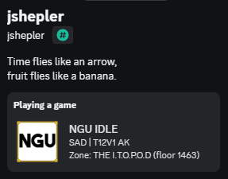
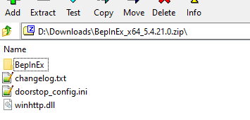
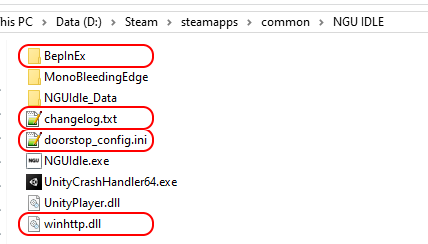
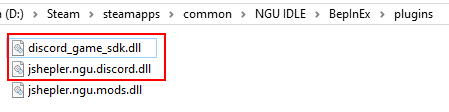
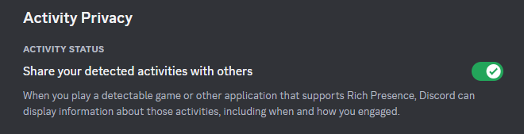

# jshepler.ngu.discord
A mod for NGU Idle that adds Discord Rich Presence support. It shows player's current difficulty, max titan defeated, and current zone or challenge.

## Installation
As with my [mod pack](https://github.com/jshepler/jshepler.ngu.mods), this mod uses [BepinEx](https://github.com/BepInEx/BepInEx) v5.4.21. If you don't already have BepinEx installed, download the `BepInEx_x64_5.4.21.0.zip` file from [that release](https://github.com/BepInEx/BepInEx/releases/tag/v5.4.21).

Extract the contents of the zip file

to NGU Idle's game folder `...\Steam\steamapps\common\NGU IDLE`.

Download the 2 dll files from the [latest release](https://github.com/jshepler/jshepler.ngu.discord/releases/latest) and put them in the plugins folder.

## Discord Settings

Make sure to have `Share your detected activities with others` enabled in discord settings:

